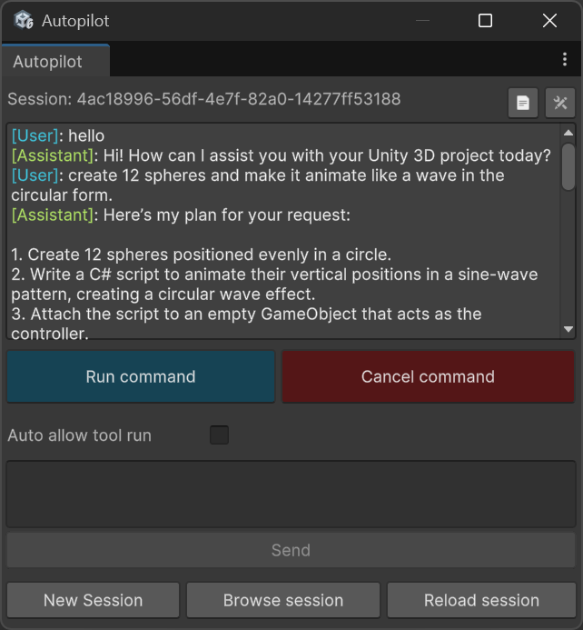

# Unity Autopilot

   Unity Autopilot is an AI-powered tool integrated into the Unity Editor, allowing developers and creators to control the editor using natural language commands—speeding up workflows by automating tasks described in plain English.

## ✨ Features

- 🧠 **Natural Language Command Execution** – Translate plain English into Unity editor actions.
- 🛠️ **Editor Automation** – Create GameObjects, modify components, manage scenes, and more through text.
- 🔌 **Customizable & Extensible** – Easily define your own command handlers and integrate with different LLM providers.
- 🤖 **Any LLM Support** – Possible to use any LLM api through a generalized API backend.

## 📊 Project Tracking

| Task                                      | Status                |
| ----------------------------------------- | --------------------- |
| Generalize LLM Communication API          | ✅ Done                |
| Manage Script & Shader Compilation Timing | ✅ Requires Testing    |
| Develop Comprehensive Tool Testing Suite  | ⚠️ Partially Complete  |
| Implement UI Builder-Based GUI            | ⏳ To Do               |
| Implement Support for Additional LLM APIs | ⏳ To Do               |
| Integrate Markdown Text Viewer            | ⏳ To Do               |
| Implement Multi-Agent Flow Architecture   | ⏳ To Do               |
| └─ Task Manager Agent                     | ⏳ To Do               |
| └─ Log Reader Agent                       | ⏳ To Do               |

## 🚀 Getting Started

### Requirements

- Unity **2022.3 LTS** or later
- Internet connection (for online LLMs)
- API key for your preferred language model provider (e.g., OpenAI, Azure, local)

## 📦 Installation

### Step 1 – Install Unity Autopilot

- **Install the Unity Autopilot package via Git URL**  
   [https://github.com/bhadrik/unity-autopilot.git?path=/Package#main](https://github.com/bhadrik/unity-autopilot.git?path=/Package#main)

### Step 2 - Run Autopilot

- **Window location:** `Window/Autopilot/Chat`

 

# Dependency

## Newtonsoft.Json.Schema

This project includes a pre-configured dependency on the Newtonsoft.Json.Schema library, version 3.0.16.

### About Newtonsoft.Json.Schema

Newtonsoft.Json.Schema is a .NET library used for validating JSON data against JSON Schema specifications. It provides a powerful and flexible way to ensure JSON data conforms to expected structures.

### Useful Links

- Official website: [https://www.newtonsoft.com/jsonschema](https://www.newtonsoft.com/jsonschema)
- GitHub Releases: [https://github.com/JamesNK/Newtonsoft.Json.Schema/releases](https://github.com/JamesNK/Newtonsoft.Json.Schema/releases)

## com.openai.unity

This is an unofficial OpenAI package to interact with the OpenAI API. This project contain modified version of this package.

### About com.openai.unity

This package is a modified version of the original repository available at [RageAgainstThePixel/com.openai.unity](https://github.com/RageAgainstThePixel/com.openai.unity).

### Useful Links

- Original Repository: [https://github.com/RageAgainstThePixel/com.openai.unity](https://github.com/RageAgainstThePixel/com.openai.unity)

 

# Source File Origins and Adaptations

This project utilizes several source files originally taken from the [unity-mcp](https://github.com/justinpbarnett/unity-mcp) repository by Justin P. Barnett as a foundational base. 

All these files have since been modified and adapted to meet the specific requirements of this current project.
